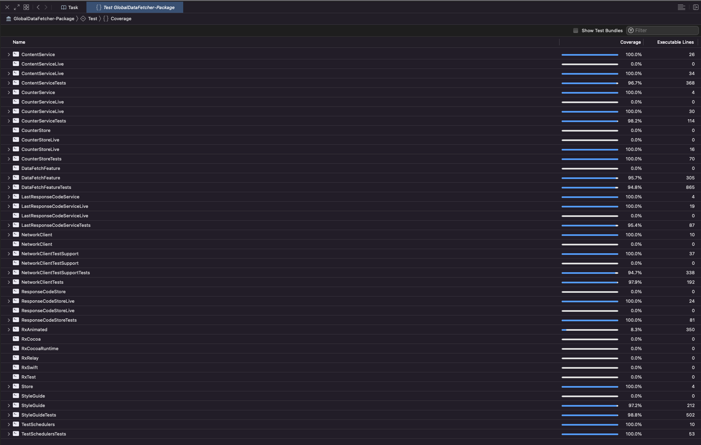

# Global Data Fetcher

A simple single screen app that fetches and persists response codes from a server.

## Running the app
This app is designed to target devices running iOS 12 and later.

In order to start the test server:
1. `cd` to the `server.py` file at the root of this package
2. run `python server.py` to make the server available on http://localhost:8000

Then, switch to the `GlobalDataFetcher` scheme and build and run the app in a simulator on the same machine as the server. 

In order to run tests, switch to the `GlobalDataFetcher-Package` scheme and `cmd + u`.

## Highlights
- Uses MVVM architecture.
- Uses hyper-modularisation project structure with clients, services, stores and features split out into individual SPM packages.
- Includes comprehensive unit tests with close to 100% coverage.
- Uses "static configuration" approach to creating stubs, mocks and spies.
- Uses RxSwift extensively for event processing and bindings.
- Uses RxTest and the `TestScheduler` for testing Observables along with a custom `ImmediateScheduler` to force observable sequences to emit immediately.
- Supports iPhone and iPad.
- Optimised for VoiceOver.
- Supports Dynamic Type.

## Project structure and app architecture
This app uses a hyper-modularisation project structure that depends mostly on Swift Package Manager and local swift packages.
By splitting modules out into separate packages, we get improved access control as we can control exactly what is `public` and what is not. It is also simple to define the dependency graph between targets and have that visible within the `Package.swift` file. Doing so also enforces best practices by adhering to the single responsibility principle: Each module is dedicated to a specific responsibility and the class/classes within them are incredibly scoped. We also gain the ability to test each module in complete isolation, whether that be a client, a service or a feature that has been modularised. Live instances are tested in isolation and injected into features in the production app. Outside of the production app scope, features only depend on the interfaces of packages 
    
In terms of the app architecture, MVVM was used in conjunction with each dependency following a "static configuration" approach. For more details about this approach see below in the *A note on static configurations* section. As it was quite a simple app that had no need for navigation, MVVM seemed good enough for the task. If navigation was to be introduced, the existing architecture could be extended to MVVM-C. For more complex feature additions, architectures like The Composable Architecture and Viper/RIBs might need to be considered.

Below are a list of the different individual packages that make up the app, along with a description that states each package's purpose:

### **StyleGuide**
At the root, we have a `StyleGuide` module that contains common branding eg. colours, as well as custom UI elements. This module will be imported into feature modules that require custom branding etc. This ensures we can keep common UI elements in a shared module rather than duplicating code or having feature modules depend on other feature modules (which is a very bad idea).

Because this only contains common elements rather than any domain- or feature-specific business logic, we don't need a `StyleGuideLive` module. `StyleGuide` should be seen as a low-level module that can be imported into any higher-level module in the dependency graph.

In our case, the only UI element that exists is a custom `AsyncButton` that inherits from `UIButton` but provides additional support for displaying an activity indicator while asynchronous tasks are in-flight. A generic `AsyncButtonAction` provides an `AsyncButtonCompletion` closure that must be invoked in order to signify that the asynchronous task has completed. In the event the completion is not invoked within a timeframe of 1 second, the loading state is change to `isLoading` (ie. the loading spinner should be shown). All of this logic is encapsulated within a generic view modal that can be reused with any other buttons that might require the same functionality.

This is a dependency of the `DataFetchFeature`.

### **NetworkClient**
The `NetworkClient` is a wrapper around `URLSession`, allowing for data to be fetched from a given URL and decoded into a given type in a single pipeline. This is a dependency of the `live` `ContentService` configuration. 

### **NetworkClientTestSupport**
This is a test support package for use when testing the `NetworkClient`. It essentially exposes a mocked `URLSession` instance that we can inject in to the `NetworkClient` in order to mock the network result (as well as spy on the `URLRequest`s that are made).

### **TestSchedulers**
This is another test support package that includes a custom `ImmediateScheduler` implementation that can be used to force `Observer`s to emit immediately so that we don't have to wait for thread hops or add delays using `XCTestExpectation`. Note that this scheduler is useful for writing tests against `Observable`s that use asynchronous operators, such as `subscribe`, but cannot be used to test `Observable`s with more complex timing logic (eg. `debounce` or `throttle` etc). 

### **Store**
The `Store` is a generic interface that supports various CRUD operations given a generic `Key` and `Value` type. It forms the basis for the `ResponseCodeStore` and the `CounterStore`. Essentially, it hides `UserDefaults` and the storing behind an abstraction layer. 

### **ResponseCodeStore**
The `ResponseCodeStore` is essentially a `typealias` of the `Store`, specific to storing `UUID` response codes. The generic `Key` and `Value` constraints are set to `String` and `UUID`. This is the interface that is used as a dependency for the live `LastResponseCodeService` configuration.

### **ResponseCodeStoreLive**
This is the live configuration of the `ResponseCodeStore`, which has a dependency on `UserDefaults` and incorporates the desired business logic around fetching and persisting response codes.

### **CounterStore**
The `CounterStore` is essentially a `typealias` of the `Store`, specific to storing data fetch task counts. The generic `Key` and `Value` constraints are set to `String` and `Int`. This is the interface that is used as a dependency for the live `CounterService` configuration.

### **CounterStoreLive**
This is the live configuration of the `CounterStore`, which has a dependency on `UserDefaults` and incorporates the desired business logic around fetching and persisting counter values.

### **ContentService**
The `ContentService` is responsible for retrieving the current data fetch count as well as incrementing and persisting updated values. This is a direct dependency of the `DataFetchFeature`.

### **ContentServiceLive**
This is the live configuration of the `ContentService`, which has a dependency on `NetworkClient`. This configuration encapsulates business logic around fetching the next path from the root URL followed by fetching the response code from the provided endpoint.


### **CounterService**
The `CounterService` is responsible for retrieving the current data fetch count as well as incrementing the values as they increase. This is a direct dependency of the `DataFetchFeature`.

### **CounterServiceLive**
This is the live configuration of the `CounterService`, which has a dependency on `CounterStore`.

### **LastResponseCodeService**
The `LastResponseCodeService` is responsible for updating and retrieving response codes. This is a direct dependency of the `DataFetchFeature`.

### **LastResponseCodeServiceLive**
This is the live configuration of the `LastResponseCodeServiceLive`, which has a dependency on `ResponseCodeStore`.

### **DataFetchFeature**
As this is a single screen app, this is the main feature, which provides the ability for a user to fetch content and receive and persist the resulting response code and data fetch count. Additionally, some basic error handling has been introduced to notify the user if, for example, they experience network connection issues and are unable to make request the relevant data. However, with most of the different aspects having been separated out into separate modules, the files that are actually in the feature are quite sparse.

The main feature state is contained within a `State` model, consisting of `responseCode`, `timesFetched` and `errorMessage` properties. Additionally, there is a `DataFetchViewModel`, which also follows the "static configuration" approach. As part of the `live` instance, we provide the relevant dependencies (ie. only the interfaces for `ContentService`, `CounterService`, `LastResponseCodeService`). Every aspect of the view model is driven by a `stateSubject` and derived `Observable`s are hooked up to the `DataFetchViewController` via bindings. This ensures that the view controller does not contain any business logic and is very minimal.

As part of the `DataFetchViewController`, corresponding feature-specific factory methods are added as extensions to `UILabel` and `UIStackView` in order to further reduce the size of the view controller and ensure each label and stack view configuration is testable in isolation.

Finally, as `RxAnimated` is utilised in the `DataFetchViewController` in order to bind properties with animation, a custom  `AnimatedSink` `Binder` was required to animate when assigning optional text to a `UILabel`.


### **App Xcode project**
With all of the core logic and features having been extracted into individual Swift packages, the actual app Xcode project is incredibly bare-bones. As this is a single-screen app, the single feature (`DataFetchFeature`) is the only feature that will be instantiated directly on the `AppDelegate`.

The live configurations for each of the service dependencies are imported into the App Xcode project and each are injected into a `DataFetchViewModel` instance. Finally, the `DataFetchViewController` instance is presented as root view controller. 

## Libraries used

The only third-party libraries that are used in this project are:
- [RxSwift](https://github.com/ReactiveX/RxSwift) was used extensively for event processing and coordination at the network/service layers as well as for bindings between the view model and view layers.
- [RxAnimated](https://github.com/RxSwiftCommunity/RxAnimated) was used for providing an animation interface to `RxCocoa`'s bindings. 

## A note on static configurations
A "static configuration" is a pattern first shown by the guys at Point-Free in their video series on [dependencies](https://www.pointfree.co/episodes/ep110-designing-dependencies-the-problem). The technique presents an alternative to using protocols in order to provide many benefits in terms of testing and ergonomics. 

While protocols are commonly used for this purpose, they are arguably overused in order to provide an interface that is only used for testing. This goes against the whole purpose of protocols, since a protocol with a minimal number of conformances is not a strong form of abstraction. Additionally, protocols are not always ideal for this purpose due to various limitations with Swift's implementation of protocols (eg. protocols as existential types).

Concrete types are almost always simpler to work with and the "static configuration" approach allows the creation of `live` and `mock` instances from a common concrete type acting as an interface. They also adhere to the common `.make` factory syntax and are a lot easier to find over managing multiple protocol concrete implementations.

For example, we define the interface as a struct instead of as a protocol:
```swift
struct ContentService {
    let fetchCurrentResponseCode: () -> Observable<ResponseCodeContent>
}
```

The `ContentService` has a single property, which is essentially the equivalent of a function declaration on the interface.
If this were a protocol, it might look something like:
```swift
protocol ContentServiceConformable {
    func fetchCurrentResponseCode() -> Observable<ResponseCodeContent>
}
``` 

We can then create a `live` static configuration instance of the class by populating the closures defined in the interface as shown below:
```swift
extension ContentService {

    private static var snakeCaseDecoder: JSONDecoder = {
        let decoder = JSONDecoder()
        decoder.keyDecodingStrategy = .convertFromSnakeCase
        return decoder
    }()

    public static func live(
        rootURLString: String = "http://localhost:8000",
        using networkClient: NetworkClient
    ) -> Self {
        Self(
            fetchCurrentResponseCode: {
                guard let rootURL = URL(string: rootURLString) else {
                    return .error(Error.invalidRootURL)
                }

                return networkClient
                    .fetch(url: rootURL, as: NextPathContent.self, using: snakeCaseDecoder)
                    .flatMap { content -> Observable<ResponseCodeContent> in
                        return networkClient.fetch(url: content.nextPath, as: ResponseCodeContent.self, using: snakeCaseDecoder)
                    }
            }
        )
    }
}
```

We see that there is business logic as well as dependencies that are required by the `live` configuration (eg. `NetworkClient`), and by separating out the interface from the `live` implementation, we avoid polluting the interface.

Another benefit is that the production implementation is completely encapsulated within the `live` configuration. If `ContentService` was itself a dependency then, rather than having to deal with its own business logic and dependencies etc, we can easily create stubs, mocks and spies that can be used far more beneficially for testing.

We can easily create a stub as follows:
```swift
static var stub: Self {
    Self(
        fetchCurrentResponseCode: {
            return .just(ResponseCodeContent(path: "/stub", responseCode: UUID()))
        }
    )
}
```

The stub doesn't need to conform to any protocol and we don't need multiple concrete instances that conform to the same protocol; we simply can create as many configurations as we want to fit each test scenario:
```swift
static func succeeding(with responseCode: UUID = UUID()) -> Self {
    Self(
        fetchCurrentResponseCode: {
            return .just(ResponseCodeContent(path: "/test", responseCode: responseCode))
        }
    )
}

static var failing: Self {
    Self(
        fetchCurrentResponseCode: {
            return .error(TestError())
        }
    )
}
```

We can then easily test static configurations as dependencies by directly instantiating the interface and fulfilling the required properties in order to essentially get a spy for free:
```swift
final class ViewModel {

    private let service: ContentService
    
    init(service: ContentService) {
        self.service = service
    }
    
    func performATask() -> Observable<Output> {
        ...
        // That uses `ContentService` behind the scenes
        return service.fetchCurrentResponseCode()
            .map { ... }
            ...
    }
}

// In our test, we can assert that the service is invoked as expected.
func test_performATaskInvokesService() {

    ...

    let spy = ContentService(
        fetchCurrentResponseCode: {
            contentServiceInvocationCount += 1
            return .empty()
        }
    )

    sut = ViewModel(service: spy)
    
    sut.performATask()
    
    ...
}

// We can also test multiple outcomes of the `sut`'s methods easily by using some of the previously defined mock configurations:
func test_performATaskFailure() {

    ...
    
    sut = ViewModel(service: .failing)
    
    sut.performATask()
        .subscribe(
            onNext: { _ in XCTFail("onNext should not be invoked") },
            onError: { expectedErrors.append($0) }
        )
        .disposed(by: disposeBag)
        
    ...
} 
```

## Testing
The app has a comprehensive suite of unit tests to help ensure future regressions are avoided and changes can be made with a high degree of confidence.

While the unit tests alone have close to 100% test coverage, I would also advocate including snapshot tests (using Point-Free's [snapshot testing library](https://github.com/pointfreeco/swift-snapshot-testing)) for the `StyleGuide` elements as well as for light-weight feature tests (since UI tests are expensive). Finally, I would also add some end-to-end UI tests to cover happy and sad path user journeys. 

These additional tests haven't currently been included but can easily be added.

Below is a screenshot of the test coverage:

